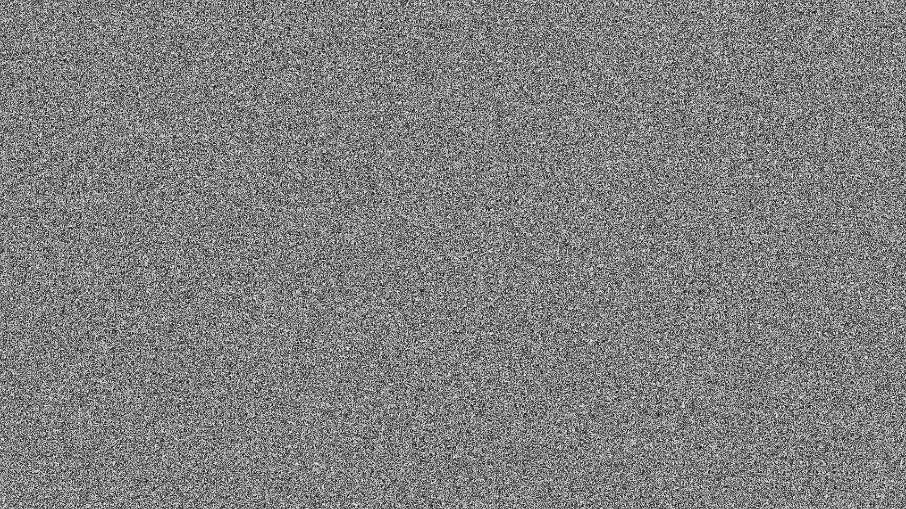
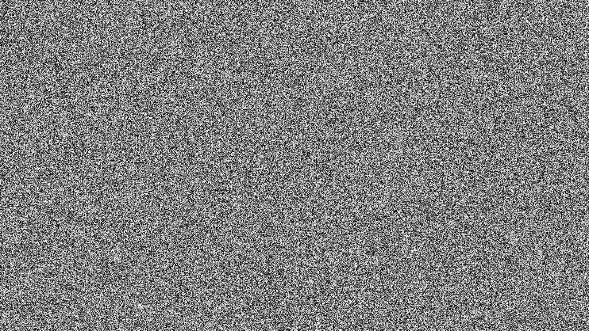

# K-HASH
A simple single header 64 bit hash function using only add, sub, ror, and xor. This a just general-purpose hash function for like making hash maps and similar data-structures. It's is not a cryptographic hash function!

It is quite easy to choose a new function at runtime by just passing a random 64 bit value to the func parameter such as:
```C
#include "khash.h"

void foo() {
    /*
    code ....
    */
    uint64_t hash = khash_fn(value, your_random_number);
    /*
    code ....
    */
}

```
## K-HASH 64 Output
Here is the output of the 64 bit hash of the integers \[0, 259199\] using 0x1dcedff1a8b17e89 as the function.



## K-HASH 32 Output

Here is the output of the 32 bit hash of the integers \[0, 518399\] using 0x6bb75f13 and 0xf9e5a345 as the function;



The output of the above images was generated by basically doing the following for a hash.

```C
for(int i = 0; i < sizeof(hash_bytes); i++) {
    pixel[img_offset + i].r = hash_bytes[i];
    pixel[img_offset + i].g = hash_bytes[i];
    pixel[img_offset + i].b = hash_bytes[i];
    pixel[img_offset + i].a = 255;
}
```
